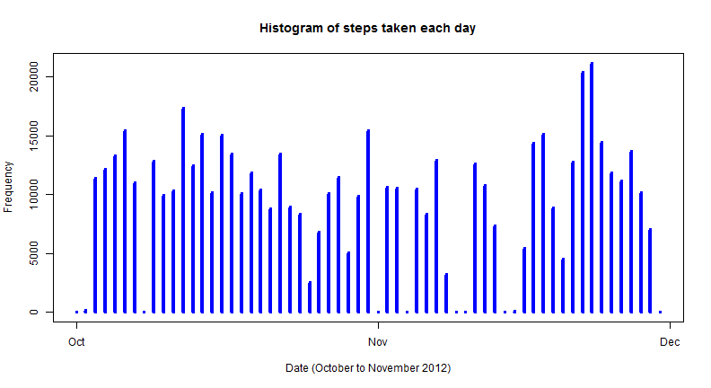
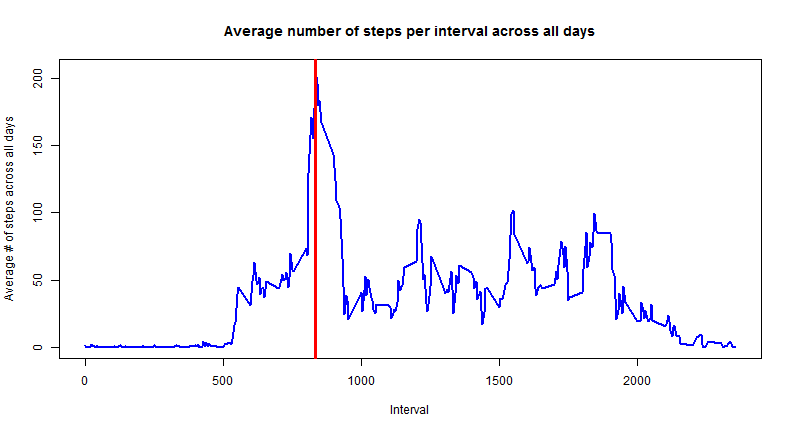
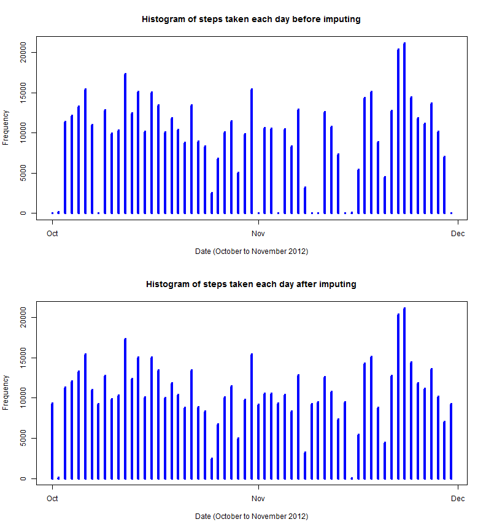
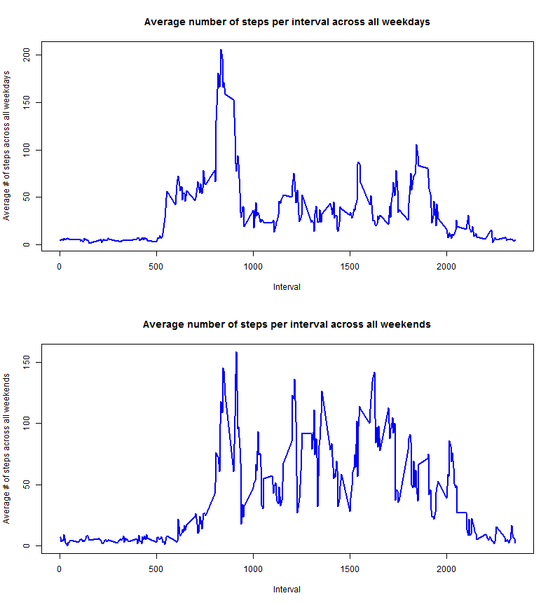

Reproducible Research Peer Assessment Assignment - Week #2

## Loading in and preprocessing data

```r
unzip("activity.zip")  # Unzip archive
dat <- read.csv("activity.csv")  # Read in data file

# Turn the date data into a valid date class Allows for easier processing
# Dates are in YYYY-MM-DD format
dates <- strptime(dat$date, "%Y-%m-%d")
dat$date <- dates

# Keep a list of all possible days
uniqueDates <- unique(dates)
# Keep a list of all possible intervals
uniqueIntervals <- unique(dat$interval)
```

## What is the mean total number of steps taken per day?


```r
# Part 2 - Create a histogram of the total number of steps taken each day
# First split up the data frame for steps by day
stepsSplit <- split(dat$steps, dates$yday)

# Next find the total number of steps over each day
totalStepsPerDay <- sapply(stepsSplit, sum, na.rm = TRUE)

# Plot a (pseudo) histogram where the x-axis denotes the day and the y-axis
# denotes the total number of steps taken for each day
plot(uniqueDates, totalStepsPerDay, main = "Histogram of steps taken each day", 
    xlab = "Date (October to November 2012)", ylab = "Frequency", type = "h", 
    lwd = 4, col = "blue")
```

 


The mean steps per day are:


```r
meanStepsPerDay <- sapply(stepsSplit, mean, na.rm = TRUE)
meanDataFrame <- data.frame(date = uniqueDates, meanStepsPerDay = meanStepsPerDay, 
    row.names = NULL)
meanDataFrame
```

```
##          date meanStepsPerDay
## 1  2012-10-01             NaN
## 2  2012-10-02          0.4375
## 3  2012-10-03         39.4167
## 4  2012-10-04         42.0694
## 5  2012-10-05         46.1597
## 6  2012-10-06         53.5417
## 7  2012-10-07         38.2465
## 8  2012-10-08             NaN
## 9  2012-10-09         44.4826
## 10 2012-10-10         34.3750
## 11 2012-10-11         35.7778
## 12 2012-10-12         60.3542
## 13 2012-10-13         43.1458
## 14 2012-10-14         52.4236
## 15 2012-10-15         35.2049
## 16 2012-10-16         52.3750
## 17 2012-10-17         46.7083
## 18 2012-10-18         34.9167
## 19 2012-10-19         41.0729
## 20 2012-10-20         36.0938
## 21 2012-10-21         30.6285
## 22 2012-10-22         46.7361
## 23 2012-10-23         30.9653
## 24 2012-10-24         29.0104
## 25 2012-10-25          8.6528
## 26 2012-10-26         23.5347
## 27 2012-10-27         35.1354
## 28 2012-10-28         39.7847
## 29 2012-10-29         17.4236
## 30 2012-10-30         34.0938
## 31 2012-10-31         53.5208
## 32 2012-11-01             NaN
## 33 2012-11-02         36.8056
## 34 2012-11-03         36.7049
## 35 2012-11-04             NaN
## 36 2012-11-05         36.2465
## 37 2012-11-06         28.9375
## 38 2012-11-07         44.7326
## 39 2012-11-08         11.1771
## 40 2012-11-09             NaN
## 41 2012-11-10             NaN
## 42 2012-11-11         43.7778
## 43 2012-11-12         37.3785
## 44 2012-11-13         25.4722
## 45 2012-11-14             NaN
## 46 2012-11-15          0.1424
## 47 2012-11-16         18.8924
## 48 2012-11-17         49.7882
## 49 2012-11-18         52.4653
## 50 2012-11-19         30.6979
## 51 2012-11-20         15.5278
## 52 2012-11-21         44.3993
## 53 2012-11-22         70.9271
## 54 2012-11-23         73.5903
## 55 2012-11-24         50.2708
## 56 2012-11-25         41.0903
## 57 2012-11-26         38.7569
## 58 2012-11-27         47.3819
## 59 2012-11-28         35.3576
## 60 2012-11-29         24.4688
## 61 2012-11-30             NaN
```


The median steps per day are:

```r
medianStepsPerDay <- sapply(stepsSplit, median, na.rm = TRUE)
medianDataFrame <- data.frame(date = uniqueDates, medianStepsPerDay = medianStepsPerDay, 
    row.names = NULL)
medianDataFrame
```

```
##          date medianStepsPerDay
## 1  2012-10-01                NA
## 2  2012-10-02                 0
## 3  2012-10-03                 0
## 4  2012-10-04                 0
## 5  2012-10-05                 0
## 6  2012-10-06                 0
## 7  2012-10-07                 0
## 8  2012-10-08                NA
## 9  2012-10-09                 0
## 10 2012-10-10                 0
## 11 2012-10-11                 0
## 12 2012-10-12                 0
## 13 2012-10-13                 0
## 14 2012-10-14                 0
## 15 2012-10-15                 0
## 16 2012-10-16                 0
## 17 2012-10-17                 0
## 18 2012-10-18                 0
## 19 2012-10-19                 0
## 20 2012-10-20                 0
## 21 2012-10-21                 0
## 22 2012-10-22                 0
## 23 2012-10-23                 0
## 24 2012-10-24                 0
## 25 2012-10-25                 0
## 26 2012-10-26                 0
## 27 2012-10-27                 0
## 28 2012-10-28                 0
## 29 2012-10-29                 0
## 30 2012-10-30                 0
## 31 2012-10-31                 0
## 32 2012-11-01                NA
## 33 2012-11-02                 0
## 34 2012-11-03                 0
## 35 2012-11-04                NA
## 36 2012-11-05                 0
## 37 2012-11-06                 0
## 38 2012-11-07                 0
## 39 2012-11-08                 0
## 40 2012-11-09                NA
## 41 2012-11-10                NA
## 42 2012-11-11                 0
## 43 2012-11-12                 0
## 44 2012-11-13                 0
## 45 2012-11-14                NA
## 46 2012-11-15                 0
## 47 2012-11-16                 0
## 48 2012-11-17                 0
## 49 2012-11-18                 0
## 50 2012-11-19                 0
## 51 2012-11-20                 0
## 52 2012-11-21                 0
## 53 2012-11-22                 0
## 54 2012-11-23                 0
## 55 2012-11-24                 0
## 56 2012-11-25                 0
## 57 2012-11-26                 0
## 58 2012-11-27                 0
## 59 2012-11-28                 0
## 60 2012-11-29                 0
## 61 2012-11-30                NA
```


```r
stepsSplit[10:12]
```

```
## $`283`
##   [1]  34  18   7   0   0   0   0   0   0   0   0   0   0   0   0   0   0
##  [18]   0   0   0   0   0   0   0   0   0   0   0   0   0   0   0   0   0
##  [35]   0   0   0   0   0   0   0   0   0   0   0   0   0   0   0   0   0
##  [52]   0   0   0   0   0   0   0   0   0   0  34   0   0   0   0   0   0
##  [69]   0   0   0   0   0   7   9  36   0  47  67   0  49  23  15  29  42
##  [86]  49  92  28  33  63  97  90 101  55  75  40  47  22  61   0   0   0
## [103]   0   0   0  60  54  16 135  61  69  32   0   0  17   0   0  69   0
## [120]  20 400 105 292 291  30   0   0  40  38   0   0   0   0   0   0  72
## [137]  37   0   0  25  17   0   0  88   7 413 326  93 334 317   0   0   0
## [154]   0  68 129   0   0   0   0   0   0   0   0   0   0   0   0   0   0
## [171] 103 119   0   0   0  70 125   0   0   0   0   0   0   0   0   0 176
## [188]  71  43 340   7  13  15   0   0   0   0   0   0   0   0   0   0  15
## [205]  50 271 106 272 308   0   0 111 281  11 139  36   0   0   0   0   0
## [222]   0  58  63 260  82 310   0   0   0   8  12 364 219   0   0   0 174
## [239] 205  12   0   0  11  17   0   0  37   0   0 105  34   0 152   0   0
## [256]   0   0   0   0   0   0   0   0   0   0   0   0 112  23  12   8   0
## [273]   0   0   0   0   7   0   0   0   0   0   0   0   0   0   8   0
## 
## $`284`
##   [1]   0   0   0   8   0   0   0   0   0   0   0   0   0   0   8   0   0
##  [18]   0   0   0   0   0   0   0   0   0   0   0   0   0   0   0   0   0
##  [35]   0   0   0   0   0   0   0   0   0   0   0   0   0   0   0   0   0
##  [52]   0   0   0   0   0 139  15   0   0   0   0   0   0   0   0   0   0
##  [69]   0   0   0  11   0  10  40   0   0  32  34 105  33   8  16  18   0
##  [86]   9   0   0  27  22   0  50   0   0   0  23  43  70 619 743 446 748
## [103] 424 747 739 741 726 166 548 343  13  26  64   0   0   0   0   0   0
## [120]   0   0   0   0   0   0   0   0   0   0   0   0   0   0   0   0   0
## [137]   0   7  46   0   0   0   0   0   0   0   0  31  45   0   0   0   0
## [154]   0   0   0   0   0   0   0   0   0   0   0   0   0   0   0   0   0
## [171]   0   0   0   0  22  27   0   0   0   0   0   0   0   0   0   0  75
## [188] 119 395  78 292 416  35   0   0  27  32   0   0   0   0   0  49  57
## [205]  34   0   0   0   0   0  39  30   9  41   7   0   0  40  22  31  19
## [222]   0   8  22  62  60   0   0   0   0   0   0   0   0   0   0   0   0
## [239]   0   0   0   0   0   0   0   0   0   0   0   0   0   0   0   0  95
## [256]   0  91  50  31   0   0   0  20  11   0   0   0   0   0   0   0   0
## [273]   0   0   0   0  11   0   0   0   0   4   0   0   0   0   0   0
## 
## $`285`
##   [1]   0   0   0   0   0   0   0   0   0   0   0   0   0   0   0   0   0
##  [18]   0  38   0   0   0   0   0   0   0   0   0   0   0   0   0   0   0
##  [35]   7   0   0   0   0   0   0   0   0   0   0   0   0   0   0   0   0
##  [52]   0   0   0  48   0   0   0   0   0   0   0   0   0   0   0   0   0
##  [69]  30  92   0  11   0  10  19 111  38  16  29   9  45  35  53  43   8
##  [86]  40   0  32  57  35 117 117  25  95  29 141  51 123 440 687 614 474
## [103] 750 742 770 735 746 748 802 280  31   0   0   0   0   0   0   7  92
## [120]   0   0   0   0   0  46   7   0 328 156   0   0   0 129 339 150   0
## [137]   0   0  70   0   9   0   0   0  70   0   0   0   0   0   0   0  18
## [154]  91   0   0   0  75   0   0   0   0  99   0   0   0   0  96  16  20
## [171] 144 321 267   0   0   0   0   0   9   0   0  24  78   0  26  35   0
## [188]   0   0 365  90 432 275  34   0  92  15   0   0   0   0  20  10   9
## [205]   0   0  32  24   0   0  38  40  19  71   2  21   0 433 463 511 298
## [222] 500 473 506  24  35  41  46   0   0   0  16  23   0   0   0  18  54
## [239]  36   0   0   0   0   0   0   0   0   0   0  18  30  23  70 113   0
## [256]   0   0   0   0   0   0   0   0   0   0   0   0   9   0   0   8   0
## [273]   0   0   0   0   0   0   0   0   0   0   0   0   0   0   0   0
```


## What is the average daily activity pattern?


```r
# Part 3 - Time-series plot (type='l') x-axis - Time interval (5, 10, 15,
# ...)  y-axis - Average number of steps taken across all days for this time
# interval

# Split up the data according to the interval
intervalSplit <- split(dat$steps, dat$interval)

# Find the average amount of steps per time interval - ignore NA values
averageStepsPerInterval <- sapply(intervalSplit, mean, na.rm = TRUE)

# Plot the time-series graph
plot(uniqueIntervals, averageStepsPerInterval, type = "l", main = "Average number of steps per interval across all days", 
    xlab = "Interval", ylab = "Average # of steps across all days", lwd = 2, 
    col = "blue")

# Find the location of where the maximum is
maxIntervalDays <- max(averageStepsPerInterval, na.rm = TRUE)
maxIndex <- as.numeric(which(averageStepsPerInterval == maxIntervalDays))

# Plot a vertical line where the max is
maxInterval <- uniqueIntervals[maxIndex]
abline(v = maxInterval, col = "red", lwd = 3)
```

 


With reference to the above plot, the interval that records the maximum number of steps averaged across all days is:


```r
maxInterval
```

```
## [1] 835
```


## Imputing missing values


```r
# Part 4 - Calculate total amount of missing values in the data set Use
# complete.cases to find a logical vector that returns TRUE if it is a
# complete row (a.k.a. no NA values) and FALSE otherwise
completeRowsBool <- complete.cases(dat$steps)
numNA <- sum(as.numeric(!completeRowsBool))
numNA
```

```
## [1] 2304
```


```r
# Modify the meanStepsPerDay vector that contains the mean steps taken for
# this 5 minute interval Each day consists of 288 intervals and there are 61
# days in total First remove NaN values and replace with 0.  NaN values are
# produced when the entire day was filled with NA values Essentially the
# mean and median would be zero anyway!
meanStepsPerDay[is.nan(meanStepsPerDay)] <- 0

# Now create a replicated vector 288 times The reason why we're doing this
# is because the slots in the vector naturally line up with the interval for
# a particular day.  Now, all we have to do is find where in the data set
# there are missing steps, and simply do a copy from one vector to the other
meanColumn <- rep(meanStepsPerDay, 288)

# The steps before replacement
rawSteps <- dat$steps

# Find any values that are NA in the raw steps data
stepsNA <- is.na(rawSteps)

# Now replace these values with their corresponding mean
rawSteps[stepsNA] <- meanColumn[stepsNA]

# Throw these back into a new data frame
datNew <- dat
datNew$steps <- rawSteps
```


Now that this is finished, let's plot a histogram of the new data:


```r
# Repeat Part 2 now First split up the data frame for steps by day
stepsSplitNew <- split(datNew$steps, dates$yday)

# Next find the total number of steps over each day There should not be an
# NA values and so we don't need to set the flag
totalStepsPerDayNew <- sapply(stepsSplitNew, sum)

# Plot a (pseudo) histogram where the x-axis denotes the day and the y-axis
# denotes the total number of steps taken for each day
par(mfcol = c(2, 1))
# Plot the original histogram first
plot(uniqueDates, totalStepsPerDay, main = "Histogram of steps taken each day before imputing", 
    xlab = "Date (October to November 2012)", ylab = "Frequency", type = "h", 
    lwd = 4, col = "blue")
# Plot the modified histogram after
plot(uniqueDates, totalStepsPerDayNew, main = "Histogram of steps taken each day after imputing", 
    xlab = "Date (October to November 2012)", ylab = "Frequency", type = "h", 
    lwd = 4, col = "blue")
```

 


```r
meanStepsPerDayNew <- sapply(stepsSplitNew, mean)
meanDataFrameNew <- data.frame(date = uniqueDates, meanStepsPerDay = meanStepsPerDay, 
    meanStepsPerDayNew = meanStepsPerDayNew, row.names = NULL)
meanDataFrameNew
```

```
##          date meanStepsPerDay meanStepsPerDayNew
## 1  2012-10-01          0.0000            32.3355
## 2  2012-10-02          0.4375             0.4375
## 3  2012-10-03         39.4167            39.4167
## 4  2012-10-04         42.0694            42.0694
## 5  2012-10-05         46.1597            46.1597
## 6  2012-10-06         53.5417            53.5417
## 7  2012-10-07         38.2465            38.2465
## 8  2012-10-08          0.0000            32.2632
## 9  2012-10-09         44.4826            44.4826
## 10 2012-10-10         34.3750            34.3750
## 11 2012-10-11         35.7778            35.7778
## 12 2012-10-12         60.3542            60.3542
## 13 2012-10-13         43.1458            43.1458
## 14 2012-10-14         52.4236            52.4236
## 15 2012-10-15         35.2049            35.2049
## 16 2012-10-16         52.3750            52.3750
## 17 2012-10-17         46.7083            46.7083
## 18 2012-10-18         34.9167            34.9167
## 19 2012-10-19         41.0729            41.0729
## 20 2012-10-20         36.0938            36.0938
## 21 2012-10-21         30.6285            30.6285
## 22 2012-10-22         46.7361            46.7361
## 23 2012-10-23         30.9653            30.9653
## 24 2012-10-24         29.0104            29.0104
## 25 2012-10-25          8.6528             8.6528
## 26 2012-10-26         23.5347            23.5347
## 27 2012-10-27         35.1354            35.1354
## 28 2012-10-28         39.7847            39.7847
## 29 2012-10-29         17.4236            17.4236
## 30 2012-10-30         34.0938            34.0938
## 31 2012-10-31         53.5208            53.5208
## 32 2012-11-01          0.0000            32.0149
## 33 2012-11-02         36.8056            36.8056
## 34 2012-11-03         36.7049            36.7049
## 35 2012-11-04          0.0000            32.4505
## 36 2012-11-05         36.2465            36.2465
## 37 2012-11-06         28.9375            28.9375
## 38 2012-11-07         44.7326            44.7326
## 39 2012-11-08         11.1771            11.1771
## 40 2012-11-09          0.0000            32.3079
## 41 2012-11-10          0.0000            32.8707
## 42 2012-11-11         43.7778            43.7778
## 43 2012-11-12         37.3785            37.3785
## 44 2012-11-13         25.4722            25.4722
## 45 2012-11-14          0.0000            32.9865
## 46 2012-11-15          0.1424             0.1424
## 47 2012-11-16         18.8924            18.8924
## 48 2012-11-17         49.7882            49.7882
## 49 2012-11-18         52.4653            52.4653
## 50 2012-11-19         30.6979            30.6979
## 51 2012-11-20         15.5278            15.5278
## 52 2012-11-21         44.3993            44.3993
## 53 2012-11-22         70.9271            70.9271
## 54 2012-11-23         73.5903            73.5903
## 55 2012-11-24         50.2708            50.2708
## 56 2012-11-25         41.0903            41.0903
## 57 2012-11-26         38.7569            38.7569
## 58 2012-11-27         47.3819            47.3819
## 59 2012-11-28         35.3576            35.3576
## 60 2012-11-29         24.4688            24.4688
## 61 2012-11-30          0.0000            32.2280
```


Like the above, the median steps per day are:

```r
medianStepsPerDayNew <- sapply(stepsSplitNew, median)
medianDataFrameNew <- data.frame(date = uniqueDates, medianStepsPerDay = medianStepsPerDay, 
    medianStepsPerDayNew = medianStepsPerDayNew, row.names = NULL)
medianDataFrameNew
```

```
##          date medianStepsPerDay medianStepsPerDayNew
## 1  2012-10-01                NA                36.09
## 2  2012-10-02                 0                 0.00
## 3  2012-10-03                 0                 0.00
## 4  2012-10-04                 0                 0.00
## 5  2012-10-05                 0                 0.00
## 6  2012-10-06                 0                 0.00
## 7  2012-10-07                 0                 0.00
## 8  2012-10-08                NA                36.09
## 9  2012-10-09                 0                 0.00
## 10 2012-10-10                 0                 0.00
## 11 2012-10-11                 0                 0.00
## 12 2012-10-12                 0                 0.00
## 13 2012-10-13                 0                 0.00
## 14 2012-10-14                 0                 0.00
## 15 2012-10-15                 0                 0.00
## 16 2012-10-16                 0                 0.00
## 17 2012-10-17                 0                 0.00
## 18 2012-10-18                 0                 0.00
## 19 2012-10-19                 0                 0.00
## 20 2012-10-20                 0                 0.00
## 21 2012-10-21                 0                 0.00
## 22 2012-10-22                 0                 0.00
## 23 2012-10-23                 0                 0.00
## 24 2012-10-24                 0                 0.00
## 25 2012-10-25                 0                 0.00
## 26 2012-10-26                 0                 0.00
## 27 2012-10-27                 0                 0.00
## 28 2012-10-28                 0                 0.00
## 29 2012-10-29                 0                 0.00
## 30 2012-10-30                 0                 0.00
## 31 2012-10-31                 0                 0.00
## 32 2012-11-01                NA                35.94
## 33 2012-11-02                 0                 0.00
## 34 2012-11-03                 0                 0.00
## 35 2012-11-04                NA                36.17
## 36 2012-11-05                 0                 0.00
## 37 2012-11-06                 0                 0.00
## 38 2012-11-07                 0                 0.00
## 39 2012-11-08                 0                 0.00
## 40 2012-11-09                NA                35.94
## 41 2012-11-10                NA                36.09
## 42 2012-11-11                 0                 0.00
## 43 2012-11-12                 0                 0.00
## 44 2012-11-13                 0                 0.00
## 45 2012-11-14                NA                36.09
## 46 2012-11-15                 0                 0.00
## 47 2012-11-16                 0                 0.00
## 48 2012-11-17                 0                 0.00
## 49 2012-11-18                 0                 0.00
## 50 2012-11-19                 0                 0.00
## 51 2012-11-20                 0                 0.00
## 52 2012-11-21                 0                 0.00
## 53 2012-11-22                 0                 0.00
## 54 2012-11-23                 0                 0.00
## 55 2012-11-24                 0                 0.00
## 56 2012-11-25                 0                 0.00
## 57 2012-11-26                 0                 0.00
## 58 2012-11-27                 0                 0.00
## 59 2012-11-28                 0                 0.00
## 60 2012-11-29                 0                 0.00
## 61 2012-11-30                NA                35.94
```


By looking at the above data frames, the only values that have changed are those days where all of the observations were missing (i.e. those days having all zeroes / `NA`).  The rest of the observations have stayed the same, which actually make sense.  The reason why this is is because if you insert more data values into a vector that are the mean of that particular vector, taking the mean will still give you the same answer.  With regards to the median vector, those rows that were filled with `NA` had all of their observations on that day filled with the mean value and so the median would obviously be the mean as well.

## Are there differences in activity patterns between weekdays and weekends?

With the new data set we have just created, we are going to split up the data into two data frames - one data frame consists of all steps taken on a weekday, while the other data frame consists of all steps taken on a weekend.  The following `R` code illustrates this for us:


```r
# Part 5 - Now split up the data so that it's sorted by weekday or weekend
# We have casted the dates to a POSIXlt class so wday is part of this class
# wday is an integer ranging from 0 to 6 that represents the day of the week
# 0 is for Sunday, 1 is for Monday, going up to 6 for Saturday Store this
# into wdays
wdays <- dates$wday

# Create a new factor variable that classifies the day as either a weekday
# or weekend First, create a numeric vector with 2 levels - 1 is for a
# weekday, 2 for a weekend
classifywday <- rep(0, 17568)  # 17568 observations overall

# Any days that are from Monday to Friday, set the numeric vector in these
# positions as 1
classifywday[wdays >= 1 & wdays <= 5] <- 1

# Any days that are on Saturday or Sunday, set the numeric vector in these
# positions as 2
classifywday[wdays == 6 | wdays == 0] <- 2

# Create a new factor variable that has labels Weekdays and Weekends
daysFactor <- factor(classifywday, levels = c(1, 2), labels = c("Weekdays", 
    "Weekends"))

# Create a new column that contains this factor for each day
datNew$typeOfDay <- daysFactor

# Now split up into two data frames
datWeekdays <- datNew[datNew$typeOfDay == "Weekdays", ]
datWeekends <- datNew[datNew$typeOfDay == "Weekends", ]
```


```r
# Further split up the Weekdays and Weekends into their own intervals
datSplitWeekdays <- split(datWeekdays$steps, datWeekdays$interval)
datSplitWeekends <- split(datWeekends$steps, datWeekends$interval)

# Find the average for each interval
meanStepsPerWeekdayInterval <- sapply(datSplitWeekdays, mean)
meanStepsPerWeekendInterval <- sapply(datSplitWeekends, mean)

par(mfcol = c(2, 1))
plot(uniqueIntervals, meanStepsPerWeekdayInterval, type = "l", main = "Average number of steps per interval across all weekdays", 
    xlab = "Interval", ylab = "Average # of steps across all weekdays", lwd = 2, 
    col = "blue")
plot(uniqueIntervals, meanStepsPerWeekendInterval, type = "l", main = "Average number of steps per interval across all weekends", 
    xlab = "Interval", ylab = "Average # of steps across all weekends", lwd = 2, 
    col = "blue")
```

 


